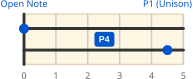
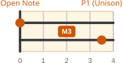

* Fingerboard Navigation
** Standard Tuning Intervals

#+caption: Most adjacent string pairs are tuned a Perfect 4th (P4) apart. The only exception is G–B, which is a Major 3rd (M3) — and this is intentional: it's what makes standard scales and basic chords playable in all keys.

** Unison Notes Across Adjacent Strings

The same pitch (a perfect unison, P1) sits different fret distances apart depending on the string pair interval.

#+caption: Perfect 4th (P4) Strings

#+caption: Major 3rd (M3) Strings

* Skeleton

#+caption: e.g. -5/+5 means higher string → −5 frets, lower string → +5 frets.
| Interval           | P4      | M3      |
|--------------------+---------+---------|
| Unison (±1 string) | -5 / +5 | -4 / +4 |
| Octave (±2 string) | +2 / -2 | +3 / -3 |
